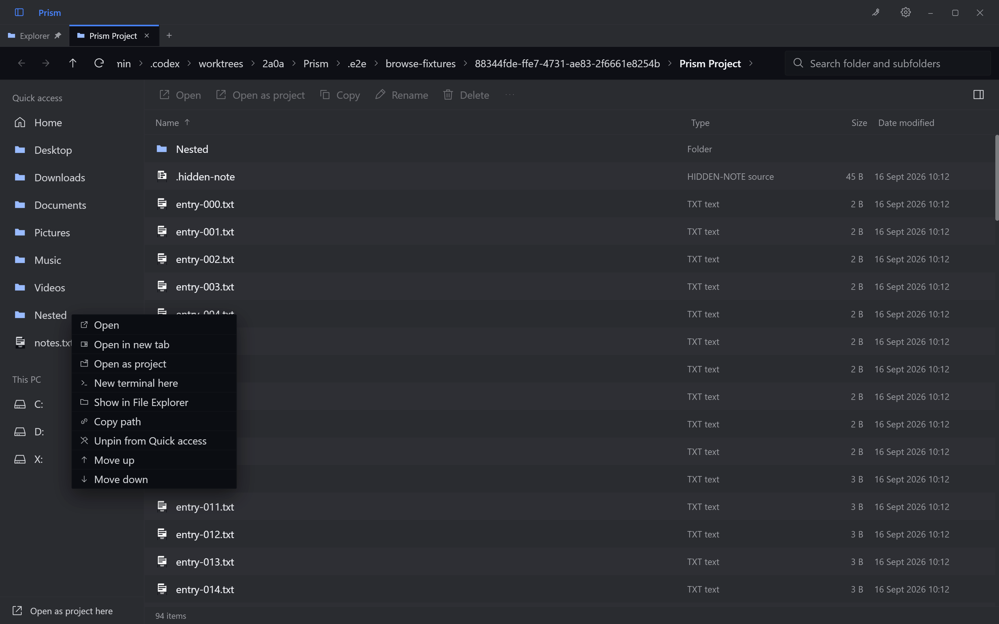
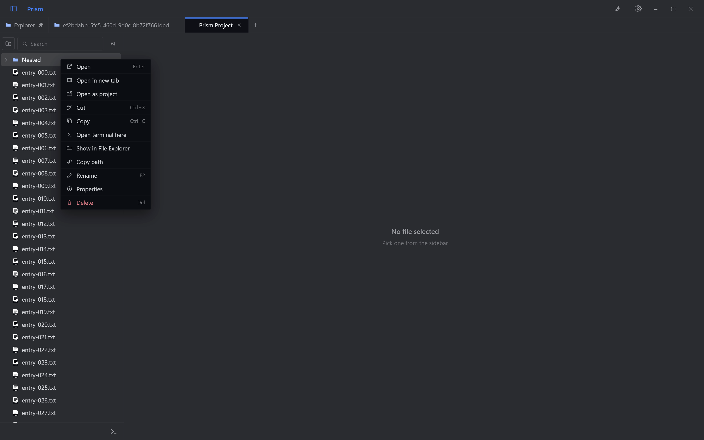
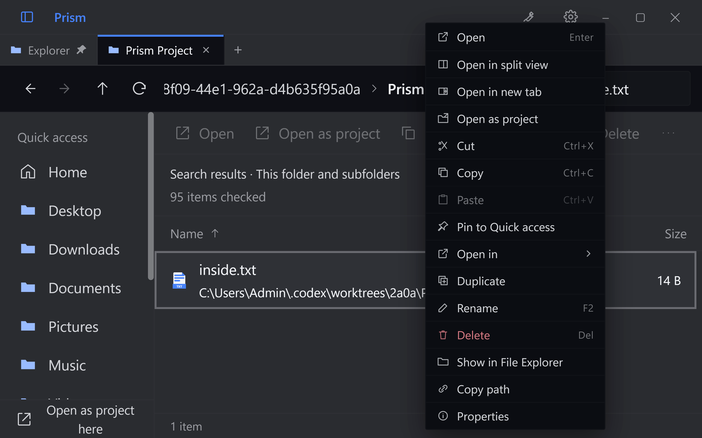
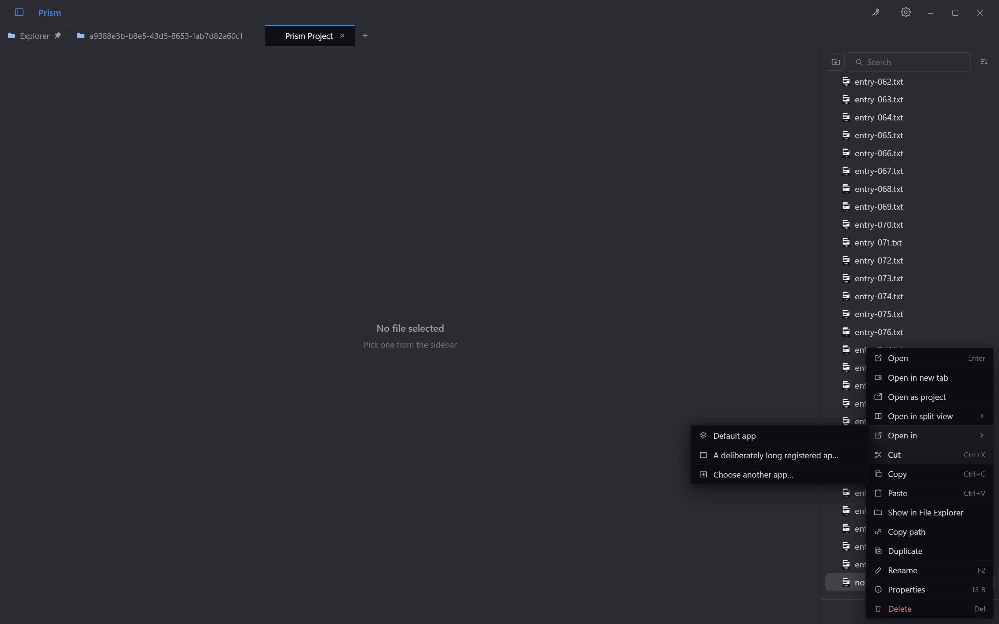

# File menu consistency audit

Scope: desktop Explorer file rows and More menu, Quick access and drive shortcuts, project
tree rows, and the shared context-menu panel. This is a targeted interaction audit, not a
whole-application accessibility assessment.

## Changes

| Finding | Result |
| --- | --- |
| Sidebar shortcuts only exposed pin management | Open, Open in new tab, Open as project, folder terminal, Show in File Explorer and Copy path are available alongside pin controls. |
| Project folders could not open in separate Explorer or project tabs | Both actions are available for folders and files, preserving the source tab. |
| The new Open action needed to match project search navigation | Opening a folder search result clears the filter and reveals the expanded folder, like clicking that result. |
| A drive could not open in a new tab before it had been browsed | Known sidebar locations establish the desktop browsing grant before opening, without adding phone shares. |
| Explorer menus had no icons | File menus use the same outlined action icons as the project tree. |
| Explorer lacked context-menu Cut and Paste | Both are available with shortcut hints. Paste targets the clicked folder, or the clicked file's parent, including search results. |
| App choices differed between views | Explorer and project files share Default app, registered apps and Choose another app. |
| Explorer Delete lacked danger styling | It uses the project's destructive-action treatment and retains confirmation. |
| Long menus ran offscreen at high zoom; late Paste insertion could shift the bottom row offscreen | Main menus and flyouts scroll within viewport bounds and re-clamp after row-count or window changes. Scrolling a parent dismisses its old flyout. |
| App/clipboard results could dismiss a hovered submenu or change its width without repositioning | Flyouts track their parent by label and re-anchor when content arrives, including one long app name replacing one loading row. |

## Deliberate differences

| Surface | Behavior retained |
| --- | --- |
| Quick access and drive shortcuts | Pin/unpin/reorder manage shortcuts. These menus do not offer Delete or Rename for their underlying targets. |
| Project tree | Project multi-selection, archive extraction, split directions and existing terminal sessions remain available. Quick access pinning stays in Explorer. |
| Explorer | One replaceable preview beside the list. New terminal here creates a project tab; Open terminal here in a project stays in that project. |
| Explorer action bar | Open as project requires a selected folder. File context menus may open the file's parent as a project with that file selected. |
| Explorer More menu | Omits Open, Copy, Rename and Delete because those actions are already in the adjacent toolbar. |
| Clipboard availability | Explorer shows Paste disabled until file clipboard data is available. The existing project menu inserts Paste when data is available. |
| File viewers | Media-specific menus retain their compact presentation and specialized controls. |

Verification exercises real folder/file/drive opening, source-tab preservation, shared icons,
native file Cut/Paste, search-result destinations and menu reachability at 200% zoom. The
broader regression suite covers existing project, viewer, archive and terminal behavior.

