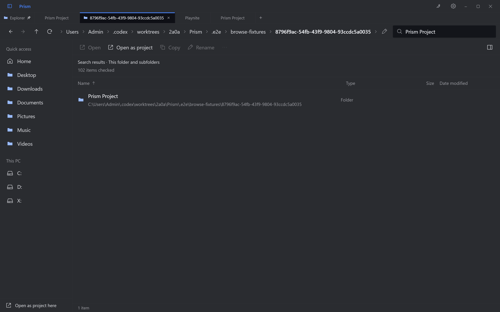
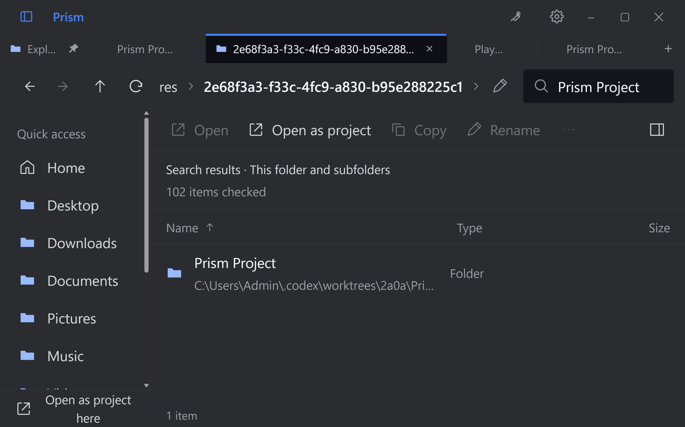
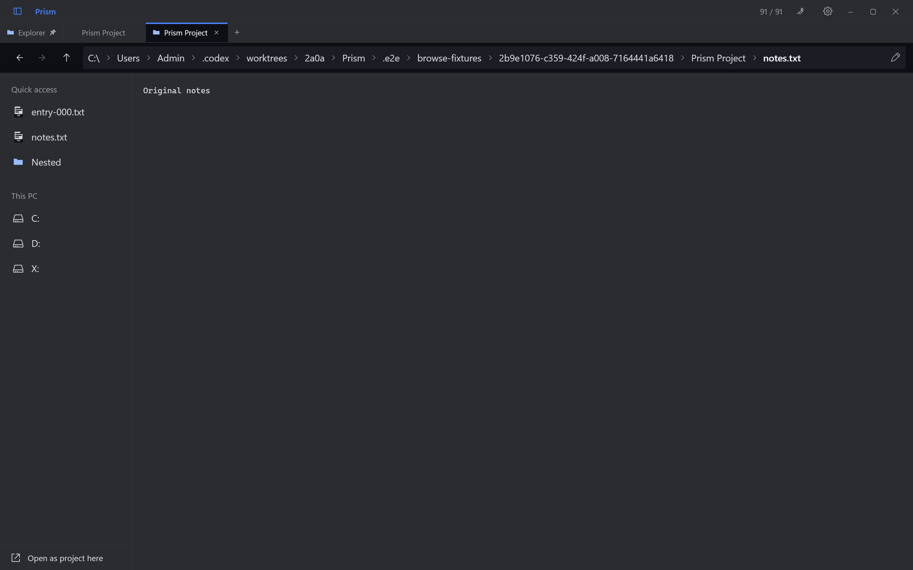
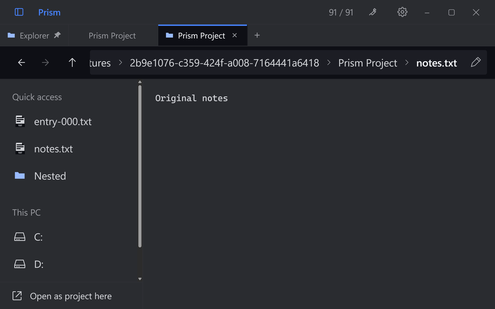
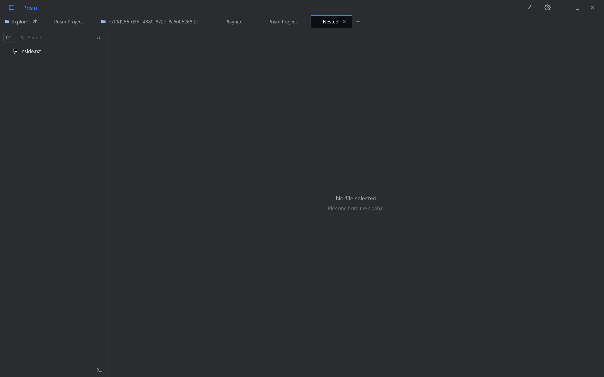
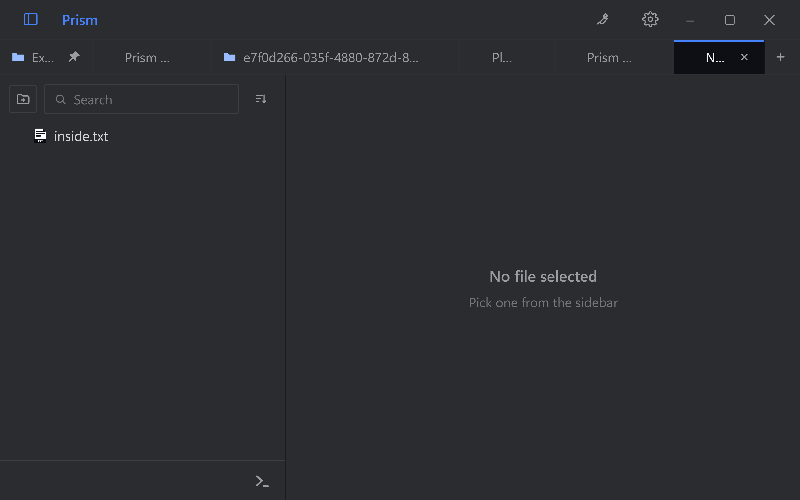
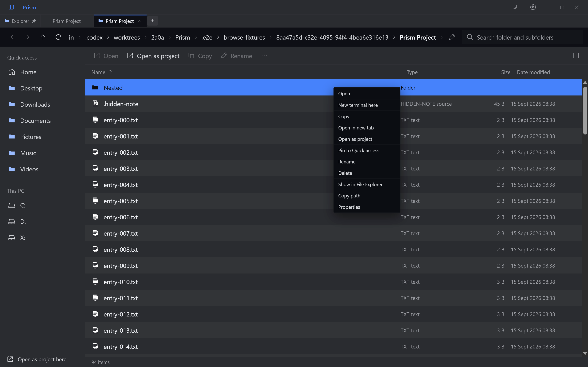
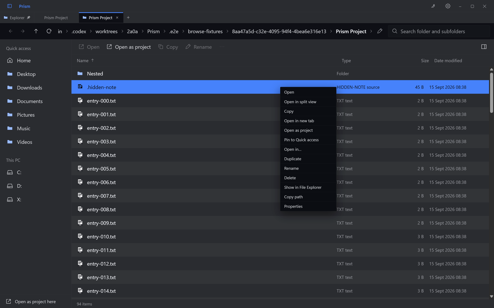
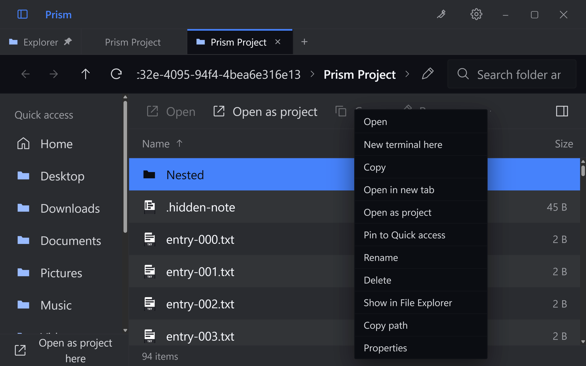

# Folder browsing

Prism's folder surface adds desktop navigation without making a working terminal follow every
folder change. The accepted brief keeps browser, media and terminal sessions in one top-level tab
strip and keeps desktop browsing separate from phone sharing.

## User behavior

- One pinned Explorer tab stays first and remembers its location. The + and Ctrl+T open ordinary
  Explorer tabs. Right-click a folder and choose Open as project to open a separate tab with a
  fixed project tree and an empty workspace, with no selected file or Explorer list. This explicit
  action starts empty regardless of the startup preference, and stays empty after restart until
  a file is selected. For a file, its containing folder becomes the project
  and that file opens. Explorer location and existing sessions stay where they were.
- The sidebar button toggles places and drives in Explorer, and the folder tree in project tabs.
  Ordinary tabs close immediately; live agents use the confirmation preference and unsaved text
  always asks. The pinned Explorer has no close action.
- Back/Forward retrace folder history; Up and ancestor breadcrumbs move to parent locations.
  Clicking empty path-bar space or Ctrl+L edits an absolute folder path. Clicking a named segment
  navigates there. Alt+Left/Right/Up provide navigation shortcuts; F5 refreshes.
- The whole path bar highlights on hover or keyboard focus. It stays above the full-file viewer,
  showing the file after its containing folder. Back, Backspace or a folder breadcrumb returns to
  the folder. Backspace inside an editor or text field still edits text.
- Every Quick access default can be unpinned. Pin any file or folder from its context menu, or
  drop it onto Quick access. Drag pins to reorder them, or use Move up/Move down in the context
  menu. Pin choices and order persist, including a deliberately empty list. File pins open the
  existing viewer; folder pins navigate. Pinning does not add phone shares.
- The list includes dotfiles, unsupported files and folders normally hidden from the viewer tree.
  Folders precede files. Search matches names in the current folder and its descendants, including
  AppData, with the shared query operators. Results show containing paths and stream while the
  search runs. Cancel, inaccessible folders, skipped links and partial results are visible. A walk
  stops after 250,000 entries, 1,000 matches or 30 seconds; it never presents this as complete.
  Name, type, size and modified-time sorting are available. Search is literal, not typo-correcting.
- Single-click selects. Double-click or Enter opens a directory or the file's existing viewer.
  Optional preview reuses that viewer. Unsupported files retain the existing fallback.
- Right-clicked rows use a distinct accent highlight and outline on both alternating row colors.
  Dismissing the menu restores the normal stripe or selected-row appearance.
- Return to folder and folder navigation pause that tab's media. Turning preview off also pauses
  it. Switching top-level tabs preserves Prism's existing intentional playback behavior.
- New terminal here creates a new top-level tab at that directory. Browsing leaves existing shells,
  agent sessions and their actual cwd alone. Ctrl+Tab and Ctrl+Shift+Tab traverse the shared strip.
- A terminal tab can return to its shell, reveal its reported folder, or deliberately use the browsed
  directory at an eligible idle prompt. Agent presence or an unfinished command prevents injected cd.

Existing tree, archive, viewer and terminal actions remain separate surfaces with their established
selection and keyboard rules. The folder list is not a new editing, thumbnail or library system.

## State and lifecycle

`src/renderer/src/lib/tabs.ts` retains project root, shell slots, file list and pinned panes.
Explorer/project roles and the single pinned Explorer persist with the tab. Existing saved tabs
retain their project behavior; opening a new Explorer does not create a phone root.
`lib/browse.ts` manages the independent browsing location and up to 100 history entries. Each entry
keeps selection, scroll, search query and sort. The surface and preview toggle are saved separately.
`lib/useFolderBrowsing.ts` coordinates directory requests, stale-result protection and media pause.

The root identifies the project/session and phone share; it does not follow casual navigation.
Existing viewer lifecycles are reused so preview does not create another player or decoder.
Dirty text stays in the application's in-memory buffer store while browsing and switching tabs.
It is subject to the existing save/discard close flow, not a new crash-recovery mechanism.

`src/main/tabs.ts` validates saved state before restore. It keeps existing absolute shell cwd even
outside the original root, restores browsing history and expanded folders, and retains existing
pinned files. Terminal pins record slot indices and are remapped to fresh shell IDs on restore.
Hidden terminals also retain their restore state. Shell processes restart; restoring an eligible
agent conversation uses the existing resume pipeline rather than preserving the old process.
Duplicate saved tab IDs retain the first owner; later duplicates receive fresh restore IDs.

## Desktop authority and phone isolation

`src/main/browse.ts` accepts explicit desktop directory navigation through the preload bridge.
`listDir(path, true)` uses the existing bounded asynchronous listing pipeline without the viewer's
file-kind and clutter filters. Tree and phone callers retain the default filtering behavior.

`src/main/desktopAccess.ts` keeps desktop grants apart from `roots.ts`. A visited directory grants
itself and immediate entries, not every descendant of a drive. Explicit tree expansion, search
results and discovered subtitle directories extend the relevant grants. Canonical path checks
continue to reject implicit junction escapes. History and mounted/dirty content can retain access
until the owning tab closes; `browseRelease` revokes its grants. A browse request already in flight
at close cannot recreate them when its listing completes.

The phone continues to use `validRoot` and `openRoots`. Visiting a parent, drive or unrelated folder
on the desktop does not make that location a phone share.
Recursive search grants only the parents of returned desktop matches. It does not follow links
or junctions, and cancellation is scoped to its tab and request.

`browseWatch(tabId, path)` explicitly watches the visible owned directory, nonrecursively, with
coalesced `dir:changed` events. One watcher is held per tab. Passing null, leaving the folder surface
or releasing the tab closes it. Granting a location for a cwd report does not change the watcher.
The browser also refreshes on focus and through Refresh.

## Verification commands

Run from the repository root on Windows:

```powershell
npm ci
npm test
npm run typecheck
npm run lint
npm run build
npm run fetch:bin
npx playwright test --config tools/e2e/browse.config.ts
npm run e2e
```

The dedicated Playwright suite uses the built Electron entry, isolated user-data profiles and
offscreen test windows. Its scenarios cover folder history, unsupported files, real shell tabs,
media/preview behavior, dirty buffers, phone scope, cwd restore and pinned-file restore.
Agent title fixtures do not prove that a real Claude or Codex conversation was exercised.
The HTML report is `.e2e/browse-report`; traces are retained on failure.

These commands describe the gates, not their latest results. Record actual outcomes and any failed
checks in the PR. A hands-on branch build must use a separate profile and must not replace the
installed Prism or close active user terminals. This document makes no installation claim.

Package the follow-up trial with `npm run package -- --config.directories.output=dist/project-empty-trial`.
Then `tools/preview-branch.ps1` opens `dist/project-empty-trial/win-unpacked/Prism.exe` with a separate
`.e2e/project-empty-profile`. Its `--preview` flag suppresses automatic Explorer menu registration so
trying the branch does not repoint the installed application's shell verb. To run the focused suite
against that executable, set `PRISM_BROWSE_EXECUTABLE` to its absolute path before invoking Playwright.
The separate output path also lets the earlier trial remain open while the new build is prepared.

## Captured interface

These native captures use isolated test profiles and generated files. The Explorer searches a
fixture workspace while separate project tabs retain their roots. The details list selects one
item at a time; established multi-selection and drag operations remain available in project trees.





The full-file viewer keeps its highlighted path bar above custom file and folder pins:





Opening a folder as a project shows its tree and waits for a file selection:





The context-menu target stays distinct on both alternating row backgrounds:






