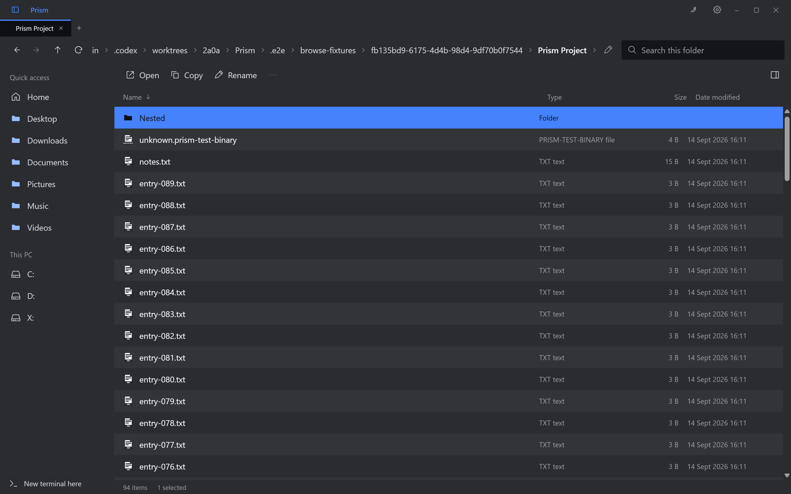
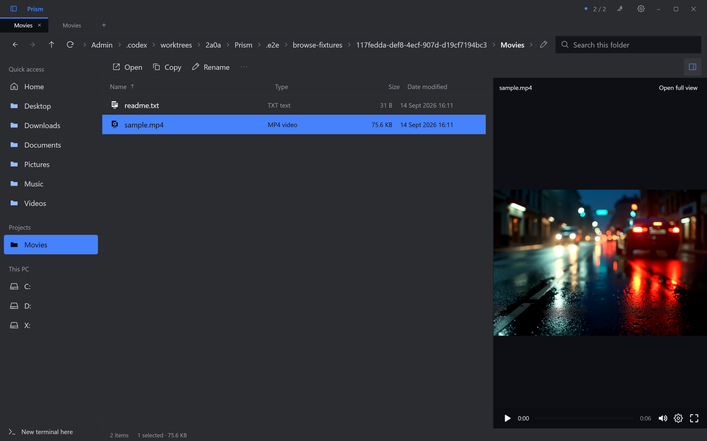
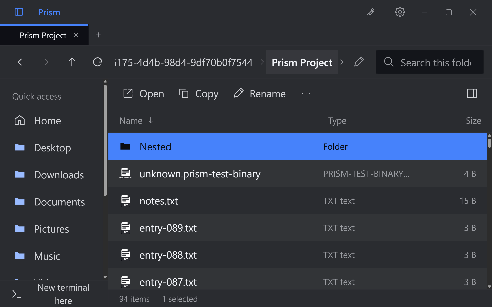

# Folder browsing

Prism's folder surface adds desktop navigation without making a working terminal follow every
folder change. The accepted brief keeps browser, media and terminal sessions in one top-level tab
strip and keeps desktop browsing separate from phone sharing.

## User behavior

- Back/Forward retrace folder history; Up and ancestor breadcrumbs move to parent locations.
  Ctrl+L edits an absolute folder path. Alt+Left/Right/Up provide navigation shortcuts; F5 refreshes.
- The list includes dotfiles, unsupported files and folders normally hidden from the viewer tree.
  Folders precede files. Search filters names in the current folder with the shared query operators;
  it is not a recursive disk search. Name, type, size and modified-time sorting are available.
- Single-click selects. Double-click or Enter opens a directory or the file's existing viewer.
  Optional preview reuses that viewer. Unsupported files retain the existing fallback.
- Return to folder and folder navigation pause that tab's media. Turning preview off also pauses
  it. Switching top-level tabs preserves Prism's existing intentional playback behavior.
- New terminal here creates a new top-level tab at that directory. Browsing leaves existing shells,
  agent sessions and their actual cwd alone. Ctrl+Tab and Ctrl+Shift+Tab traverse the shared strip.
- A terminal tab can return to its shell, reveal its reported folder, or deliberately use the browsed
  directory at an eligible idle prompt. Agent presence or an unfinished command prevents injected cd.

Existing tree, archive, viewer and terminal actions remain separate surfaces with their established
selection and keyboard rules. The folder list is not a new editing, thumbnail or library system.

## State and lifecycle

`src/renderer/src/lib/tabs.ts` retains project root, shell slots, file list and pinned panes.
`lib/browse.ts` manages the independent browsing location and up to 100 history entries. Each entry
keeps selection, scroll, search query and sort. The surface and preview toggle are saved separately.
`lib/useFolderBrowsing.ts` coordinates directory requests, stale-result protection and media pause.

The root identifies the project/session and phone share; it does not follow casual navigation.
Existing viewer lifecycles are reused so preview does not create another player or decoder.
Dirty text stays in the application's in-memory buffer store while browsing and switching tabs.
It is subject to the existing save/discard close flow, not a new crash-recovery mechanism.

`src/main/tabs.ts` validates saved state before restore. It keeps existing absolute shell cwd even
outside the original root, restores browsing history and expanded folders, and retains existing
pinned files. Terminal pins record slot indices and are remapped to fresh shell IDs on restore.
Hidden terminals also retain their restore state. Shell processes restart; restoring an eligible
agent conversation uses the existing resume pipeline rather than preserving the old process.
Duplicate saved tab IDs retain the first owner; later duplicates receive fresh restore IDs.

## Desktop authority and phone isolation

`src/main/browse.ts` accepts explicit desktop directory navigation through the preload bridge.
`listDir(path, true)` uses the existing bounded asynchronous listing pipeline without the viewer's
file-kind and clutter filters. Tree and phone callers retain the default filtering behavior.

`src/main/desktopAccess.ts` keeps desktop grants apart from `roots.ts`. A visited directory grants
itself and immediate entries, not every descendant of a drive. Explicit tree expansion, search
results and discovered subtitle directories extend the relevant grants. Canonical path checks
continue to reject implicit junction escapes. History and mounted/dirty content can retain access
until the owning tab closes; `browseRelease` revokes its grants. A browse request already in flight
at close cannot recreate them when its listing completes.

The phone continues to use `validRoot` and `openRoots`. Visiting a parent, drive or unrelated folder
on the desktop does not make that location a phone share.

`browseWatch(tabId, path)` explicitly watches the visible owned directory, nonrecursively, with
coalesced `dir:changed` events. One watcher is held per tab. Passing null, leaving the folder surface
or releasing the tab closes it. Granting a location for a cwd report does not change the watcher.
The browser also refreshes on focus and through Refresh.

## Verification commands

Run from the repository root on Windows:

```powershell
npm ci
npm test
npm run typecheck
npm run lint
npm run build
npm run fetch:bin
npx playwright test --config tools/e2e/browse.config.ts
npm run e2e
```

The dedicated Playwright suite uses the built Electron entry, isolated user-data profiles and
offscreen test windows. Its scenarios cover folder history, unsupported files, real shell tabs,
media/preview behavior, dirty buffers, phone scope, cwd restore and pinned-file restore.
Agent title fixtures do not prove that a real Claude or Codex conversation was exercised.
The HTML report is `.e2e/browse-report`; traces are retained on failure.

These commands describe the gates, not their latest results. Record actual outcomes and any failed
checks in the PR. A hands-on branch build must use a separate profile and must not replace the
installed Prism or close active user terminals. This document makes no installation claim.

After packaging, `tools/preview-branch.ps1` opens `dist/win-unpacked/Prism.exe` with a separate
`.e2e/hands-on-profile`. Its `--preview` flag suppresses automatic Explorer menu registration so
trying the branch does not repoint the installed application's shell verb. To run the focused suite
against that executable, set `PRISM_BROWSE_EXECUTABLE` to its absolute path before invoking Playwright.

## Captured interface

These are native captures from isolated test profiles, with generated files and simulated agent titles.
The preview contains a short test video generated from a retained demonstration photograph.






