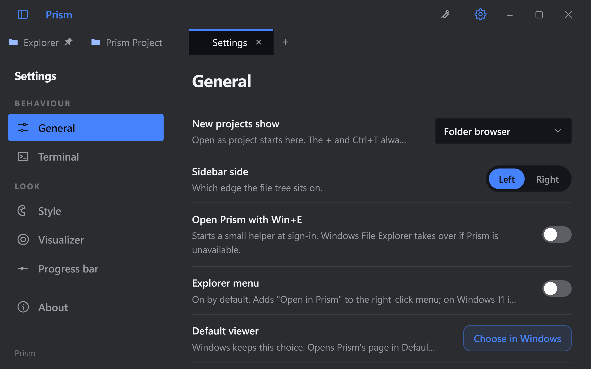
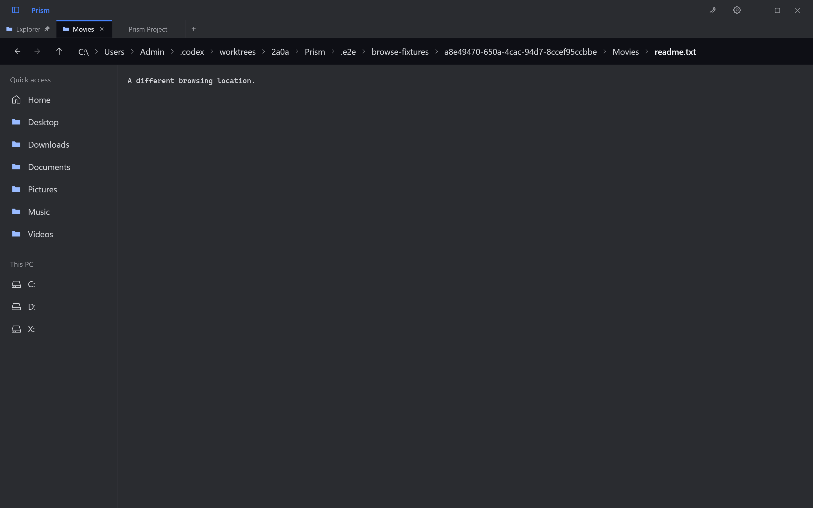

# Optional Windows Explorer shortcut

Settings > General > **Open Prism with Win+E** is off by default. Enabling it starts
a small Windows helper and registers that helper at sign-in for the current user.
Prism itself can close normally. Win+E launches or raises Prism and returns to its
pinned Explorer folder tab, preserving project files and terminals.

The setting reads Windows state, confirms changes, and reports failures. It is
available only in packaged Windows builds. A different Prism installation or
profile cannot take ownership until the existing owner disables the setting.

The helper intercepts only plain Win+E. Other keys and modified combinations pass
through. It does not log keys or replace Explorer associations, system files or
Windows shortcut registry mappings. Disabling the setting stops the helper and
removes only its own startup entry. A normal uninstall does the same; upgrading
pauses the helper and preserves opt-in for Prism's next launch.

If Prism fails to launch or does not acknowledge a rendered Explorer folder within
eight seconds, the helper launches Windows File Explorer. If Prism or its resources
disappear, the helper stops interception and removes its owned startup entry on its
next lifecycle check. If the helper is stopped, crashes, or is absent, Windows keeps
its native Win+E behavior. Deleting an inactive installation can leave a harmless
startup entry pointing at a missing helper; that entry cannot intercept Win+E.

Explorer tabs never repeat the active filename in the title bar, including full-file
view with places collapsed. Project tabs still show the active filename when their
sidebar is closed and a full terminal is not covering the file.

## Verification

- `npm run test:win-e` builds the helper and exercises ownership, disable, deletion,
  upgrade pause, literal Windows argument quoting and real named-pipe ACK/timeouts.
  It uses temporary registry keys and never remaps the actual desktop shortcut.
- Unit tests cover default-off startup, confirmed setting changes, serialization,
  failed-state readback and queued startup/renderer handshakes.
- Explorer Playwright tests exercise the General setting with mocked Windows state,
  titlebar visibility, cold startup and warm second-instance requests. The latter
  use real named pipes and the packaged app with isolated profiles, without a hook.
- Actual physical Win-key masking, sign-in, crash-hook removal and installed
  upgrade/uninstall require verification in a disposable Windows session before
  release. The automated checks do not claim those desktop lifecycle cases.

Native implementation and build details: [helper reference](../native/win-e/README.md).

